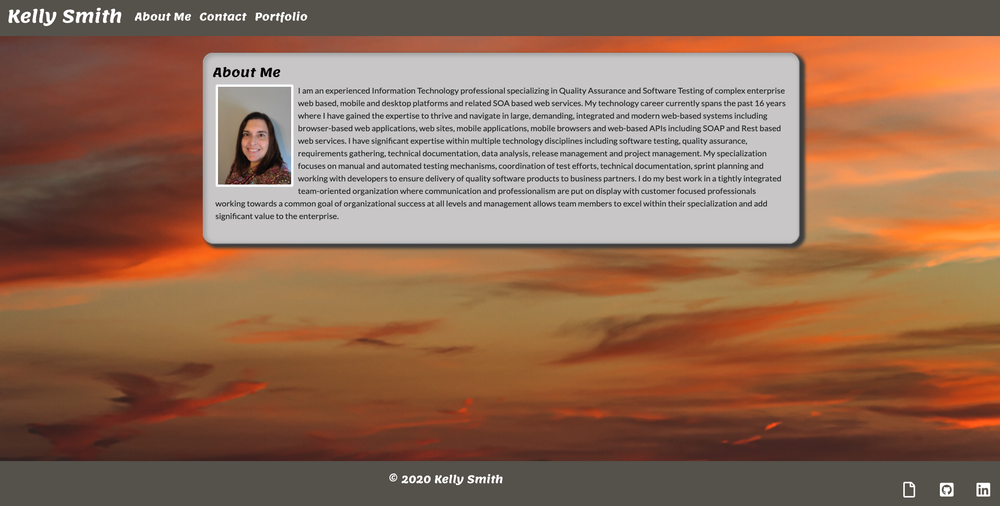
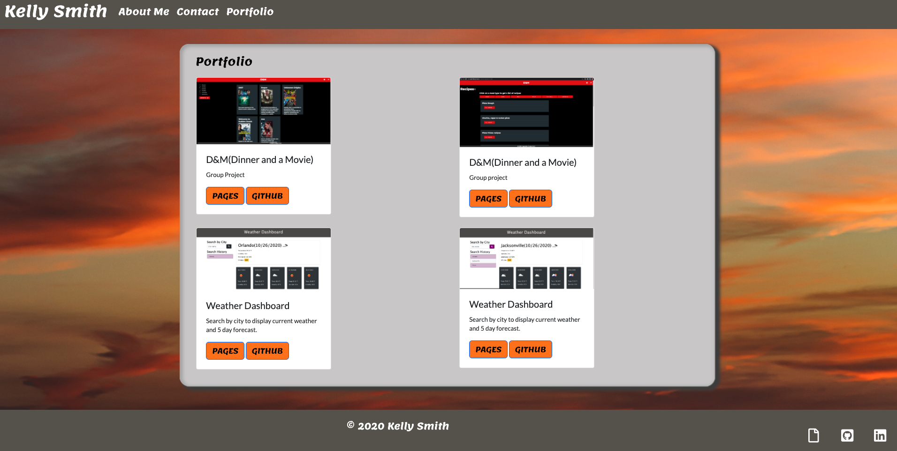

# Responsive Portfolio

*This is my portfolio website. It is created to showcase my work. Initially it will contain an About Me page, a Portfolio page, and a Contact page. This is used to showcase my abilities as a developer and also includes a  link to view my resume.

## Webpage created using:
* HTML - to create the content of the homepage. 
* CSS -  to style the content.
* Bootstrap - to create a navigation bar, containers and grids for content, a footer and a responsive layout

## Features
### Navbar
* contains links to About Me, Portfolio and Contact pages
* uses bootstrap nav bar
* uses custom colors for background and text (in css file)

### Background
* image added to background to replace default

### About Me
* contains a paragraph about me
* content is reponsive to various screen sizes
* content sits inside a container within a grid
* colors set for background and text (in css file)

### Portfolio
* contains screen shots for 2 projects with links to the live site and my github repository
* content is reponsive to various screen sizes
* images sit inside a container within a grid
* colors set for background and text (in css file)

### Contact Me
* contains a bootstrap form with input fields for Name, Email and a Message
* content is reponsive to various screen sizes
* additional rows added to Message to make the input field larger
* form contains a button to submit the contact form; button can be pressed but no information is currently sent; will be updated at later date
* colors set for background and text (in css file)

### Footer
* is a sticky footer
* content is reponsive to various screen sizes
* information will be added to footer at a later date
* colors set for background and text (in css file)

## The challenges I met were:

## The website is being hosted on github pages.
* https://kellys-tech.github.io/index.html

## Website Images:

